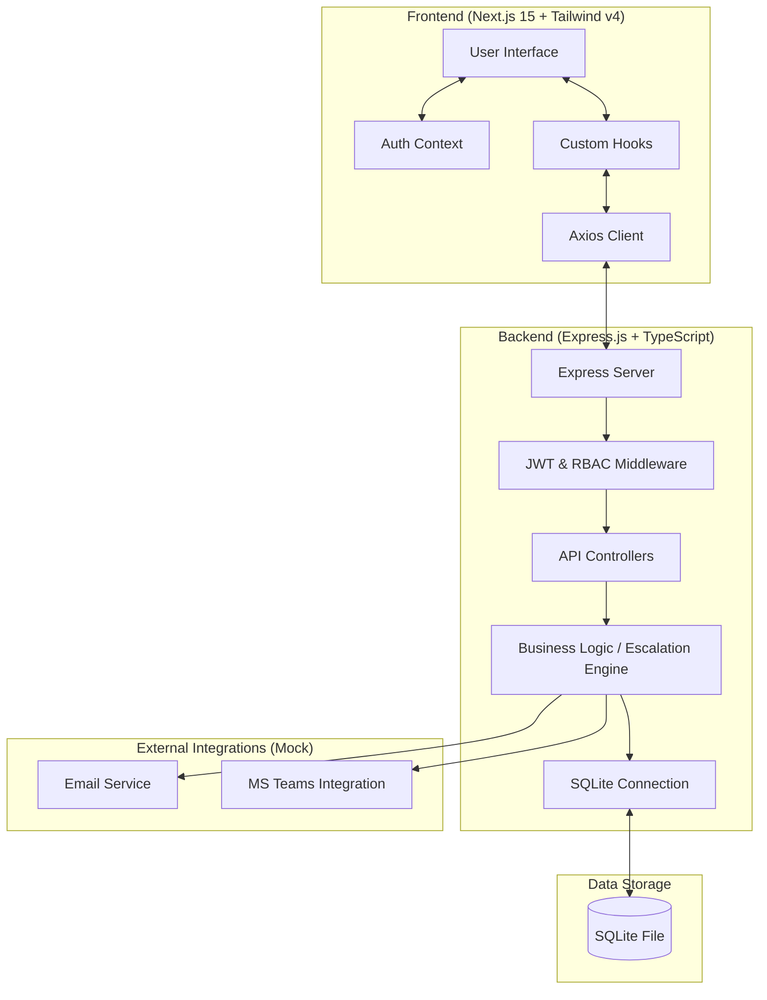
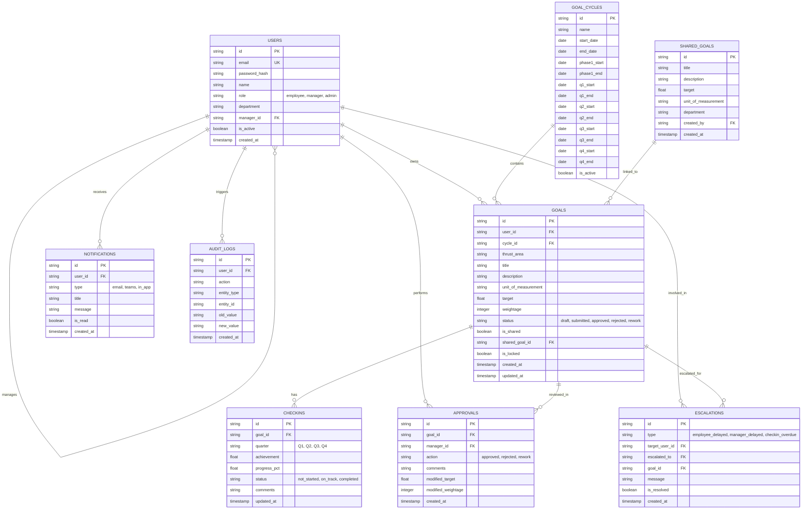

# AtomGoal Architecture & Data Model

## 1. System Architecture Diagram

```mermaid
graph TB
    subgraph "Frontend (Next.js 15 + Tailwind v4)"
        UI[User Interface]
        AuthC[Auth Context]
        Hooks[Custom Hooks]
        APIClient[Axios Client]
    end

    subgraph "Backend (Express.js + TypeScript)"
        Server[Express Server]
        Middleware[JWT & RBAC Middleware]
        Controllers[API Controllers]
        Services[Business Logic / Escalation Engine]
        DBConfig[SQLite Connection]
    end

    subgraph "Data Storage"
        DB[(SQLite File)]
    end

    subgraph "External Integrations (Mock)"
        Email[Email Service]
        Teams[MS Teams Integration]
    end

    UI <--> AuthC
    UI <--> Hooks
    Hooks <--> APIClient
    APIClient <--> Server
    Server --> Middleware
    Middleware --> Controllers
    Controllers --> Services
    Services --> DBConfig
    DBConfig <--> DB
    Services --> Email
    Services --> Teams
```

## 2. Entity Relationship (ER) Diagram

```mermaid
erDiagram
    USERS {
        string id PK
        string email UK
        string password_hash
        string name
        string role "employee, manager, admin"
        string department
        string manager_id FK
        boolean is_active
        timestamp created_at
    }

    GOAL_CYCLES {
        string id PK
        string name
        date start_date
        date end_date
        date phase1_start
        date phase1_end
        date q1_start
        date q1_end
        date q2_start
        date q2_end
        date q3_start
        date q3_end
        date q4_start
        date q4_end
        boolean is_active
    }

    SHARED_GOALS {
        string id PK
        string title
        string description
        float target
        string unit_of_measurement
        string department
        string created_by FK
        timestamp created_at
    }

    GOALS {
        string id PK
        string user_id FK
        string cycle_id FK
        string thrust_area
        string title
        string description
        string unit_of_measurement
        float target
        integer weightage
        string status "draft, submitted, approved, rejected, rework"
        boolean is_shared
        string shared_goal_id FK
        boolean is_locked
        timestamp created_at
        timestamp updated_at
    }

    CHECKINS {
        string id PK
        string goal_id FK
        string quarter "Q1, Q2, Q3, Q4"
        float achievement
        float progress_pct
        string status "not_started, on_track, completed"
        string comments
        timestamp updated_at
    }

    APPROVALS {
        string id PK
        string goal_id FK
        string manager_id FK
        string action "approved, rejected, rework"
        string comments
        float modified_target
        integer modified_weightage
        timestamp created_at
    }

    NOTIFICATIONS {
        string id PK
        string user_id FK
        string type "email, teams, in_app"
        string title
        string message
        boolean is_read
        timestamp created_at
    }

    AUDIT_LOGS {
        string id PK
        string user_id FK
        string action
        string entity_type
        string entity_id
        string old_value
        string new_value
        timestamp created_at
    }

    ESCALATIONS {
        string id PK
        string type "employee_delayed, manager_delayed, checkin_overdue"
        string target_user_id FK
        string escalated_to FK
        string goal_id FK
        string message
        boolean is_resolved
        timestamp created_at
    }

    USERS ||--o{ USERS : "manages"
    USERS ||--o{ GOALS : "owns"
    USERS ||--o{ APPROVALS : "performs"
    USERS ||--o{ NOTIFICATIONS : "receives"
    USERS ||--o{ AUDIT_LOGS : "triggers"
    USERS ||--o{ ESCALATIONS : "involved_in"
    GOAL_CYCLES ||--o{ GOALS : "contains"
    SHARED_GOALS ||--o{ GOALS : "linked_to"
    GOALS ||--o{ CHECKINS : "has"
    GOALS ||--o{ APPROVALS : "reviewed_in"
    GOALS ||--o{ ESCALATIONS : "escalated_for"
```
